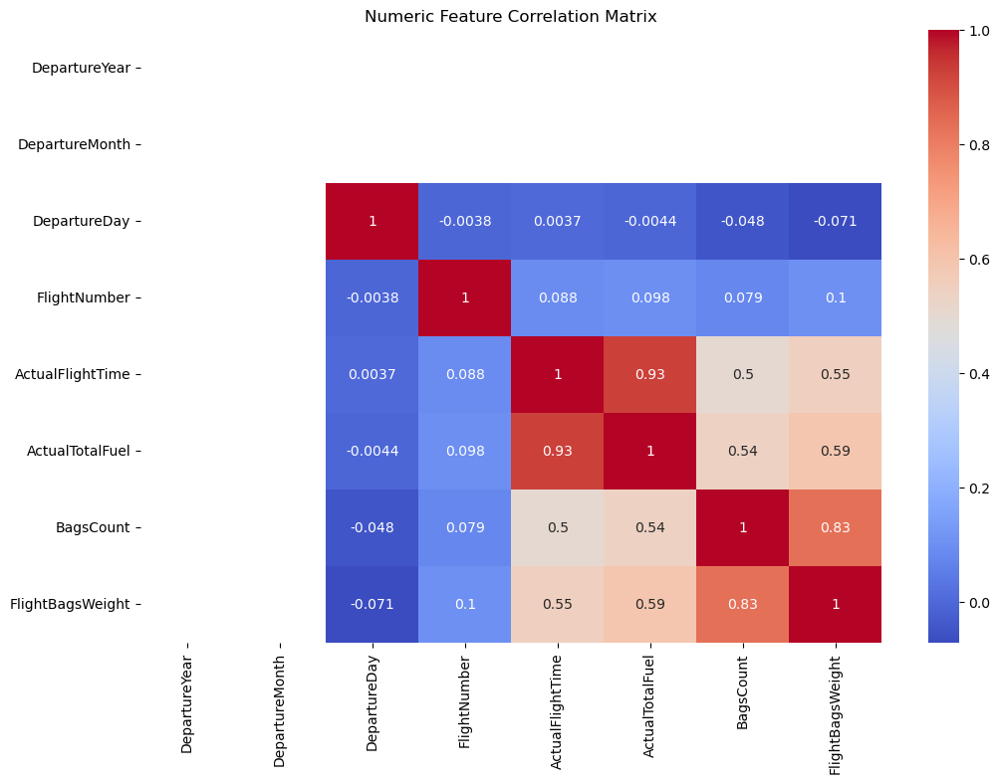
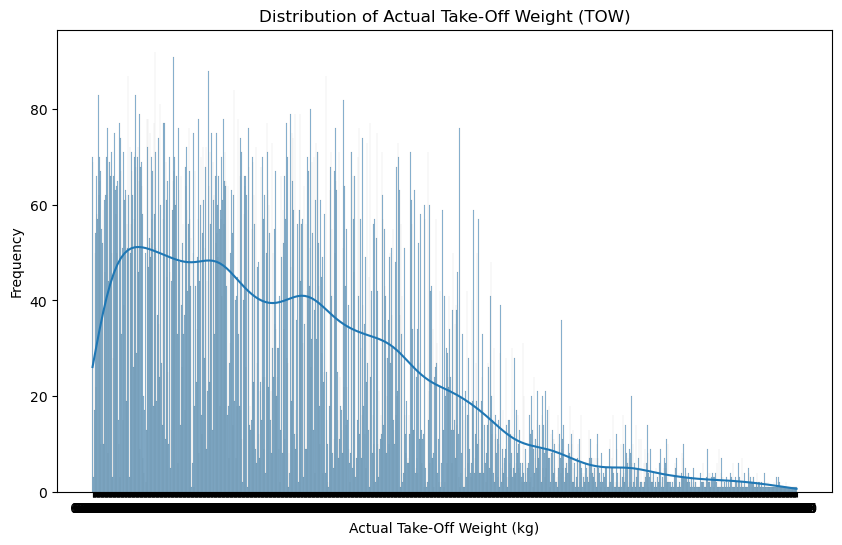
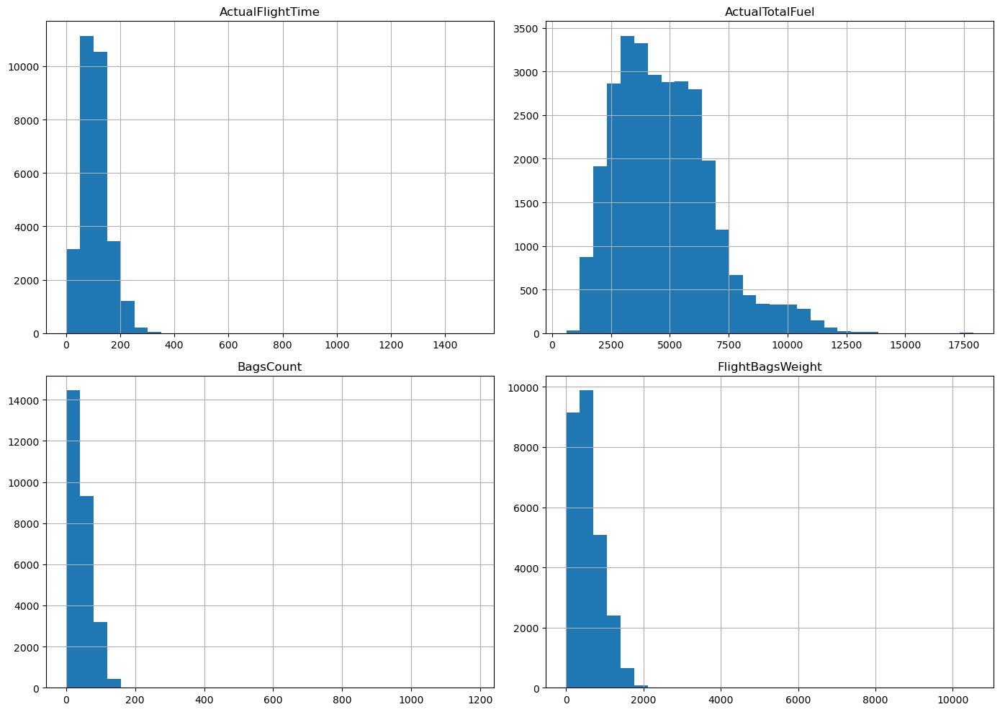
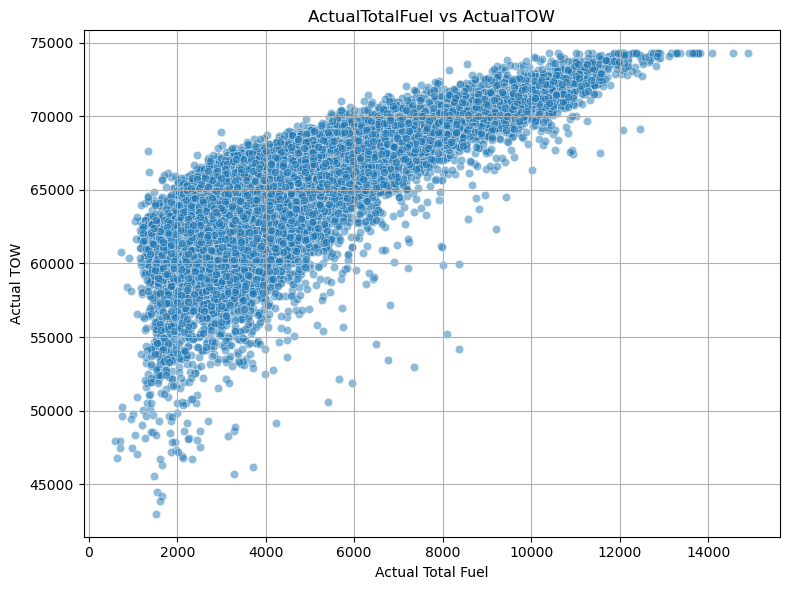
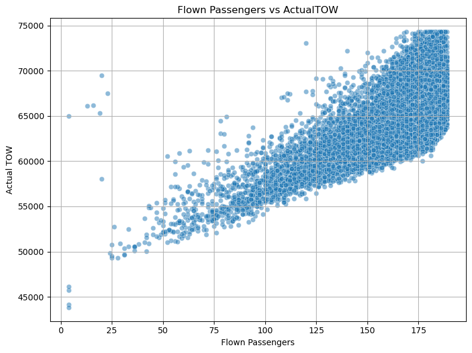

# Ryanair Fuel Consumption Modeling

This project aims to build machine learning models to **predict aircraft Actual Take-Off Weight (ActualTOW)** using flight operational data from Ryanair. The project includes complete pipelines for preprocessing, feature engineering, model training, evaluation, and visualization.

## 📁 Project Structure

├── data/
│ ├── raw/
│ │ ├── training.csv                                    # training set
│ │ ├── validation.csv                                  # validation set for testing
│
├── images/
│ ├── images.png                                        # there are images that will be used for description in README.md file
│
├── models/
│ ├── <best_model>.pkl          # there are multiple .pkl models. the models are trained and saved or only the best can be left
│
├── notebooks/
│ ├── 01_Exploratory_Data_Analysis.ipynb                # notebook for EDA. insights, information will be shared
│ ├── 02_Model_Comparization_and_Insights.ipynb         # visualization of RMSE values based on trained models
│
├── reports/
│ ├── rmse_results.csv                                  # rmse results for all models and its settings
│ ├── predictions.csv                                 # prediction result for TOW column in validation set by best performed model 
│
├── scripts/
│ ├── preprocessing.py                                  # preprocessing data to make it ready for usage in training
│ ├── feature_engineering.py                            # feature engineering for preprocessed data with new added features
│ ├── training.py                                       # model trainings by different settings and different methods
│ ├── evaluation.py                                     # evaluation of validation set based on best performed model in training
│
├── main.py                                             # main file to initialize training and testing
├── requirements.txt                                    # Python dependencies
└── README.md                                           


---

## 🚀 Getting Started

### 1. Clone the Repository

```bash
git clone <>
cd ryanair-fuel-modeling
```

### 2. Install Dependencies

```bash
pip install -r requirements.txt
```

### 3. Run the Training Pipeline

Either using terminal or running main.py file by ide. Important Note: all files include LOGs to track error line in case of failure in execution. These can be deleted as well.

```bash
python main.py
```

This will:

* Process raw training/validation data
* Train models with different combinations of preprocessing strategies
* Save models and log RMSEs
* Output results in `reports/rmse_results.csv`

## Exploratory Data Analysis (EDA)

EDA was performed in `01_Exploratory_Data_Analysis.ipynb`. Here are some insights:

* When I displayed the head of the dataframe, I saw that some values are collected in (null) format which corresponds to a missing value. More importantly, this code snippet:

```bash
missing_values = train_df.isnull().sum()
print(f'Missing values count - {missing_values} and missing values in training data: {missing_values[missing_values > 0]}')
```

Displayed not even a single missing value per column. And this code snippet:

```bash
train_df.info()
```

showed that these important columns are stored as object type. This required handling missing values and formatting number columns as float values. Also, date column needed to be formatted as datetime format.

### Key insights from the columns:

* The dataset covers a two-week flight window, and `DepartureYear` / `DepartureMonth` are constant, so they can be dropped.

* Significant missing data in some columns. These require careful imputation or row dropping depending on the strategy.

* Extreme values (outliers) detected in some columns. These are likely data entry issues or rare cases — ideal for outlier handling (e.g., IQR, z-score, winsorization). It can also be clearly seen in boxplots for features.

* Some columns have a lot of unique values. Maybe will need one-hot or target encoding due to high cardinality and perhaps dimension reduction.

* Scaling in some important features.



**Correlation heatmap shows** some strong positive correlations:

* between `ActualFlightTime` - `ActualTotalFuel`: This can be interpreted as longer flights consume more fuel which make sense.

* between `BagsCount` - `FlightBagsWeight`: This can be interpreted as more bags means more baggage weight which also make sense

and some weak correlations:

* `FlightNumber`, `DepartureDay`, `DepartureMonth`, `DepartureYear` show almost no correlation with other features. Dropping or Feature Engineering might be needed.



This plot can be interpreted as:

* Most flights have moderate or lower take-off weights.

* The tail of the distribution shows a few extreme values. Indicates the need for outlier detection or winsorization.

* There are fewer flights with very high TOW.

**Exploration of categorical columns include top most 15 frequent features for each column.**



This plot can be interpreted as: 

* `ActualFlightTime`: Highly right-skewed distribution. Majority of flights are short-haul, around 60–180 minutes.

* `ActualTotalFuel`: Right-skewed, though more bell-shaped. Most flights consume between 3000–6000 units of fuel. Few flights go beyond 10,000+, suggesting either long-haul flights or outliers.

* `BagsCount`: Very narrowly distributed, most flights carry fewer than 100 bags. The sharp drop after 100 suggests the bulk of flights are standard short-haul where baggage count is low.

* `FlightBagsWeight`: Right-skewed. Reflects expected correlation: as bags increase, total weight increases. Most values under 2000kg.



This plot can be interpreted as: 

* There is a strong positive correlation between total fuel and TOW as the amount of fuel increases, the TOW also increases. Fuel is a significant contributor to TOW, and this relationship is mostly linear until a cap is reached.



This plot can be interpreted as: 

* there is a clear positive linear relationship as the number of passengers increases, TOW increases. The pattern forms a dense cloud with a sloped linear alignment, showing TOW is highly dependent on the passenger count.

## Data Preprocessing

Handled in `scripts/preprocessing.py` and executed in `main.py`. The module contains functions to clean and prepare raw data before model training. Here's what each part of the module does:

**Handles missing values in both numeric and categorical columns using a defined strategy.**

Strategy Options (determines how to fill missing values): 

* `mean` : Fills with column mean
* `median`: Fills with column median
* `most_frequent`: Fills with most common value
* `constant`: Fills with a specified constant
* `drop`: Drop rows with missing value

**Performs winsorization which is reducing the influence of extreme outlier values (not by removing but by clipping them) by:**

* limitting extreme values in the upper and lower tails (clips of 1% of lowest and highest values in this case) to prevent extreme values from excessively impacting model training

**Removes rows that contain outliers based on two different strategies:**

* `iqr`: Removes values not between first quartile and third quartile based on the formula: 

    `[Q1 - 1.5×IQR, Q3 + 1.5×IQR]`

* `zscore`: Removes rows with z-scores above a threshold based on the formula:

    

where x - raw score, μ - population mean and σ - population standard deviation

**Creates a ColumnTransformer pipeline for `Sklearn` which applies preprocessing in:**

* `Numeric Features`: Scales using `StandardScaler`

* `Categorical Features`: Encodes with `OneHotEncoder`


## Feature Engineering

The `scripts/feature_engineering.py` module creates domain-specific and transformed features to enhance model performance. These features are derived using operational knowledge of airline data.

**Creates a fuel-efficiency metric (fuel used per passenger) to normalize total fuel use by passenger load.** Handles divide-by-zero by replacing with np.nan

**Estimates total payload (approximate aircraft load), assuming: Average passenger weight as 80 kg and adds total baggage weight**. Answer to question why 80 kg comes from international regulatory and operational guidelines:

* `EASA`: Avg adult weight: ~84 kg

* `FAA`: Avg adult weight: 190 lbs(~86 kg) for winter

* `ICAO`: Avg adult weight: ~75–85 kg depending on region/method

This is why 80 kg is selected.

**Provides insight into baggage load per unit, helping detect unusually heavy or light luggage trends.** Avoids divide-by-zero.

**Adds polynomial features by expanding selected numeric features using polynomial interactions to capture non-linear relationships. There is a pairwise degree in adding new features like `FuelPerPassenger^2`, `FuelPerPassenger * AvgBagWeight`, etc.**

## Training and Evaluation

Model performance is evaluated using Root Mean Squared Error (RMSE) on a held-out test set. The lowest RMSE indicates the best balance between bias and variance.

The training phase starts with train-test splitting then pipeline generation by preprocessed pipeline combined with regressor. Initially lightweight models such as Ridge and Linear Regression and running them with combination of different data strategies:

* `Missing values`: mean, median, drop

* `Outlier removing`: iqr, zscore, none

Therefore, there will be 3 × 3 = 9 combinations per model, and with 2 models a total of 18 RMSE results. This help us to choose the settings with best performed model (lowest RMSE) and these settings will be used in more computationally intensive models such as 

* Lasso
* Gradient Boosting
* Random Forest
* XGBoost
* and also improved version of Lasso which is called LassoCV that applies Cross Validation. 

All models are trained and evaluated, and the best model overall is selected based on RMSE. This model is then used to generate predictions on the validation set. All RMSE results with their strategy settings will be saved to a file `reports/rmse_results.csv`

### ⚠️ Note on Lasso Convergence

During training, the Lasso Regression model produced a `ConvergenceWarning`:

`Objective did not converge. You might want to increase the number of iterations.`

Despite the warning, the model achieved a low RMSE, indicating strong performance. The warning suggests that the optimization algorithm did not fully converge within the set number of iterations `(max_iter=5000)`.

One tip is to increase the max_iter but since it potentially increases the execute time, I did not try it.

## Potential Improvements (due to time constrains and machine capacity):

* All models (including RandomForest, GBM, XGBoost, etc.) could be trained across all strategy combinations for more comprehensive comparison. 

* All methods can be trained using hyperparameter tuning. Especially for Ridge and Lasso, alpha value can be trained in Grid Search. 

* More models and regularization techniques can be included. (ElasticNet, LightGBM, SVR, Decision Tree etc.)

* Cross-validation can be applied

* More feature engineering methods or feature selection techniques

* XAI methods for more explainability.

## Visualization

Visualizations based on collected RMSE results can be seen in `notebooks/02_Model_Comparization_and_Insights.ipynb` including:

* RMSE by model type

* RMSE by missing/outlier strategies

* Heatmaps of combinations

* Best model insights

# 🧾 Acknowledgment

This project is completed for Ryanair-Labs Internship task. It aims to help optimize fuel and weight efficiency by accurately modeling aircraft take-off weight.

# 👤 Author

Emre Beray Boztepe
